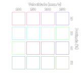

# Duplotech 1610

![alt text][img_1610]

## Especificações

- ^^Área útil:^^
    - 1600mm(x) 1000mm(y)

- ^^Potência:^^
    - 120W

- ^^Materiais:^^
    - Corte:
        - Acrílico (até 6mm)
        - MDF (até 3mm)
        - Plásticos (que não tenham Cloro na composição)
        - Couro
    - Gravação:
        - Alumínio anodizado
        - Acrílico
        - MDF
        - Madeiras

[img_1610]:https://www.insper.edu.br/wp-content/uploads/2021/06/Duplotech-1610.jpg "Duplotech Laser 1610"

## Software

O software usado para configurar os arquivos para a laser e o [RDWorks 8.1][1]

## Arquivo de teste

## Parametros

- ^^Acrílico 3mm(CORTE):^^

    - **Speed**: 20 mm/s
    - **Power**: 65 - 70 %

 - ^^Acrílico 6mm(CORTE):^^

     - **Speed**: 10 mm/s
     - **Power**: 85 - 90 %

 - ^^MDF 3mm(CORTE):^^

     - **Speed**: 12 mm/s
     - **Power**: 65 - 70 %

 - ^^Compensado 10mm(CORTE):^^

     - **Speed**: 12 mm/s
     - **Power**: 80 - 852 %

## Gerar arquivos de corte

**Arquivo DXF**:

- Importar arquivos DXF para o [RDWorks][1].
- Setar parametros de velocídade e potencia para cada cor.
- Clicar em **"Salvar U file"** para exportar para o pendrive

[1]: https://www.duplotech.com.br/download.php?file=downloads/rdcam-8148.rar
